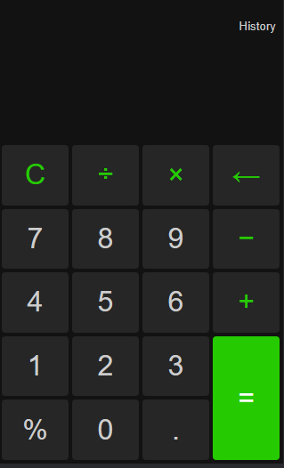
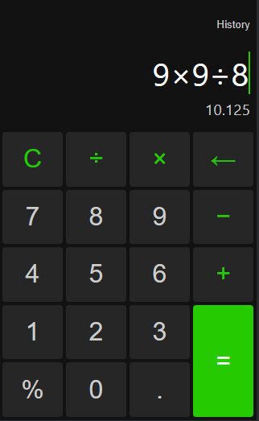
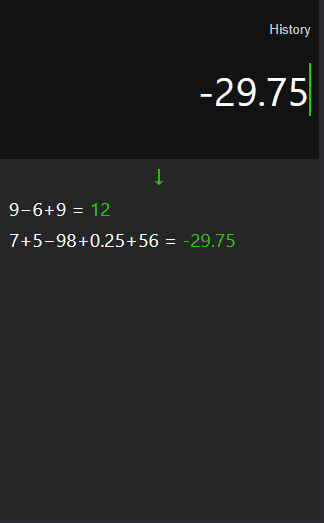
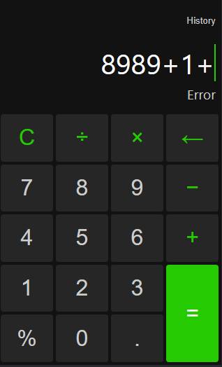
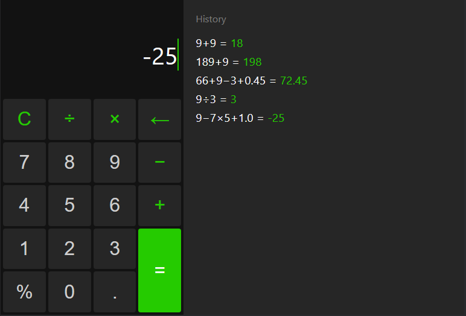

# Calculator App

A simple and user-friendly calculator built with HTML, CSS, and JavaScript. Perform basic arithmetic operations and enjoy a clean interface for easy calculations.

## Screenshots

### Default View

;

### Inputs / Expression

;

### Computation History

;

### Validation

;

### Desktop View

;
